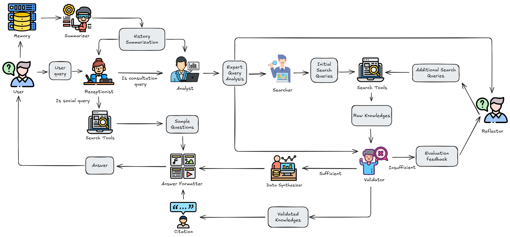

<div align="center">
<a href="https://chatuet.id.vn/">

</a>
</div>

<div align="center">

# QUESTIN: VIRTUAL CONSULTING PLATFORM
[](https://opensource.org/licenses/MIT) [](https://www.python.org/downloads/release/python-31016/)
</div>

<p align="center" >
  <a href="./README.md">English</a> |
  <a href="./README_vi.md">Vietnamese</a>
</p>

<details open>
<summary><b>📕 Table of Contents</b></summary>

- 📌 [Introduction](#-introduction)
- 🎮 [Demo](#-demo)
- 🔎 [System Architecture](#-system-architecture)
- 🎬 [Get Started](#-get-started)
- 🔧 [Configurations](#-configurations)

</details>


## 📌 Introduction

In this repository, we introduce ***Questin***, an advanced Agentic RAG-based approach designed to enhance virtual advisory systems. Instead of relying on a single retrieval-response mechanism, ***Questin*** employs a multi-agent architecture where specialized agents collaboratively handle different aspects of the query-answering process. This includes query evaluation, knowledge retrieval, validation, synthesis, and contextual response formatting.

Our system significantly improves answer relevance and accuracy compared to commercial and research-based solutions. ***Questin*** achieves an *Answer Relevancy* score of **0.79**, outperforming Mindmaid by **12.86**% and Kotae by **97.5**%. Furthermore, our model provides more precise responses, achieving a **41/50** correctness rate, surpassing MindMaid (**23/50**) and Kotae (**6/50**), while minimizing hallucinations.

Compared to research-driven approaches, ***Questin*** balances faithfulness and efficiency, achieving **4.2**% - **42.8**% higher Faithfulness and **2.6**% - **5.2**% higher Similarity. It also attains the highest *Context F1-Score*, outperforming other retrieval methods by **5.3**% - **23.6**%, ensuring comprehensive and precise information extraction.

## 🎮 Demo

Try our demo at [https://chatuet.id.vn](https://chatuet.id.vn).

## 🔎 System Architecture



***Questin*** is designed as a multi-agent system where each agent specializes in a specific task to optimize query processing and response generation. The workflow begins with the *Receptionist Agent*, which evaluates the relevance of incoming queries. If a query is deemed out of scope or social in nature, it retrieves and suggests example questions from the database. Otherwise, relevant queries are forwarded to the next stage.

The *Analyst Agent* then analyzes the query in depth, providing structured guidance for subsequent processing. The *Searcher Agent* decomposes the query and retrieves relevant knowledge using sources like web search and hybrid retrieval. To maintain high-quality information, the *Validator Agent* continuously assesses retrieved data before passing it to the *Reflector Agent*, which refines knowledge by generating additional sub-queries to fill in missing information.

Once sufficient data is gathered, the *Data Synthesizer* integrates the collected knowledge into a coherent response, while the *Answer Formatter* ensures that the final output is well-structured and contextually appropriate. Additionally, the Summarizer compiles key insights from each interaction, improving response continuity for future queries.

The system is built on a modular framework with five key components: LLM, Planning, Tools, Memory, and Agent Interaction. This structured approach ensures flexibility, making it easy to customize, scale, and integrate Questin into various domains beyond virtual advisory applications.

## 🎬 Get Started

### 📝 Prerequisites

- CPU >= 4 cores
- RAM >= 16 GB
- Disk >= 50 GB
- Docker >= 24.0.0 & Docker Compose >= v2.26.1
  > If you have not installed Docker on your local machine (Windows, Mac, or Linux),
  > see [Install Docker Engine](https://docs.docker.com/engine/install/).

### 🚀 Start up the server

1. Clone the repo:

   ```bash
   $ git clone https://github.com/phamtungthuy/Questin-TechSpark.git
   ```

3. Start up the server using the pre-built Docker images:

   > The command below downloads the latest edition of the Questin Docker image.To download a Questin edition different from the latest, update the `QUESTIN_IMAGE` variable accordingly in **docker/.env** before using `docker compose` to start the server. For example: set `QUESTIN_IMAGE=phamtungthuy/questin:0.1` for the latest edition.
   ```bash
   $ docker compose -f docker-compose-image.yml up -d
   ```

   > The command below will build a Docker image in local.
   ```bash
   $ docker compose up -d
   ```
   
   > The command below will run with GPU.
   ```bash
   $ docker compose -f docker-compose-gpu.yml up -d
   ```
   
   > The command below will run with the existing image with GPU:
   ```bash
   $ docker compose -f docker-compose-image-gpu.yml up -d
   ```


4. Check the server status after having the server up and running:

   ```bash
   $ docker logs -f questin
   ```

   _The following output confirms a successful launch of the system:_

   ```bash

       ___  _   _ _____ ____ _____ ___ _   _ 
      / _ \| | | | ____/ ___|_   _|_ _| \ | |
     | | | | | | |  _| \___ \ | |  | ||  \| |
     | |_| | |_| | |___ ___) || |  | || |\  |
      \__\_\\___/|_____|____/ |_| |___|_| \_  

   ```

5. In your web browser, enter the IP address of your server and log in to Questin.
   > With the default settings, you only need to enter `http://IP_OF_YOUR_MACHINE` (**sans** port number) as the default
   > HTTP serving port `3000` can be omitted when using the default configurations.
6. In folder fastapi/service_conf.yaml, copy [service_conf-sample.yaml](./fastapi/conf/service_conf-sample.yaml) to service_conf.yaml. After that, in serrvice_conf.yaml, select the desired LLM factory in `user_default_llm` and update
   the `API_KEY` field with the corresponding API key.

   _The show is on!_

## 🔧 Configurations

When it comes to system configurations, you will need to manage the following files:

- [.env](./.env): Keeps the fundamental setups for the system, such as `QUESTIN_SERVER_PORT`, `ELASTIC_PASSWORD`, `MYSQL_PASSWORD`, 
  `MINIO_PASSWORD`, v.v.
- [service_conf-sample.yaml](./fastapi/conf/service_conf-sample.yaml): Configures the back-end services. The environment variables in this file will be automatically populated when the Docker container starts. Any environment variables set within the Docker container will be available for use, allowing you to customize service behavior based on the deployment environment.
- [docker-compose.yml](./docker-compose.yml): The system relies on [docker-compose.yml](./docker-compose.yml) to start up.

Server also serves an embedding model and a reranking model:
- Embedding model: **keepitreal/vietnamese-sbert** with base URL **http://questin:8000**.
- Reranking model: **hiieu/halong_embedding** with base URL **http://question:8000/rerank**. 

Updates to the above configurations require a reboot of all containers to take effect:

> ```bash
> $ docker compose -f docker-compose.yml up -d
> ```


