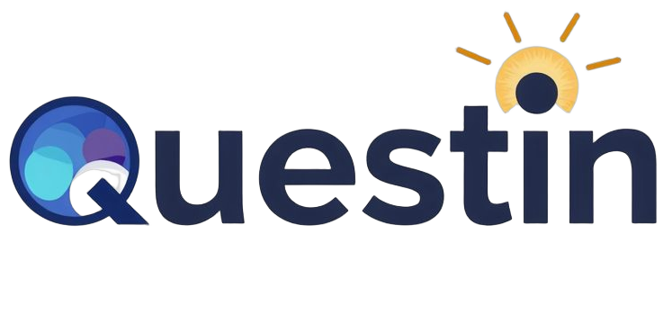
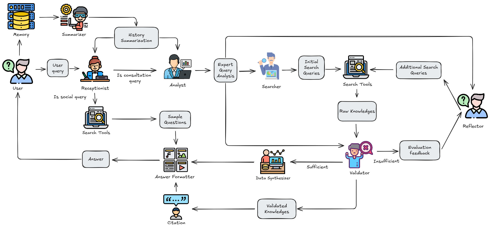

<div align="center">
<a href="https://chatuet.id.vn/">

</a>
</div>

<div align="center">

# QUESTIN: HỆ THỐNG TƯ VẤN VIÊN ẢO
[](https://opensource.org/licenses/MIT) [](https://www.python.org/downloads/release/python-31016/)
</div>


<p align="center" >
  <a href="./README.md">English</a> |
  <a href="./README_vi.md">Vietnamese</a>
</p>

<details open>
<summary><b>📕 Mục Lục</b></summary>

- 📌 [Giới thiệu](#-introduction)
- 🎮 [Bản Demo](#-bản-demo)
- 🔎 [Kiến Trúc Hệ Thống](#-kiến-trúc-hệ-thống)
- 🎮 [Bắt Đầu](#-bắt-đầu)
- 🔧 [Cấu Hình](#-cấu-hình)

</details>

## 📌 Giới thiệu

Trong repository này, chúng tôi giới thiệu ***Questin***, một phương pháp tiên tiến dựa trên Agentic RAG nhằm nâng cao hệ thống tư vấn ảo. Thay vì chỉ dựa vào một cơ chế truy xuất - phản hồi duy nhất, ***Questin*** áp dụng kiến trúc đa tác tử, trong đó các tác tử chuyên biệt phối hợp xử lý từng khía cạnh khác nhau của quy trình hỏi - đáp. Các tác vụ bao gồm đánh giá truy vấn, truy xuất tri thức, xác thực, tổng hợp và định dạng phản hồi theo ngữ cảnh.

Hệ thống của chúng tôi cải thiện đáng kể mức độ liên quan và độ chính xác của câu trả lời so với các giải pháp thương mại và nghiên cứu hiện có. ***Questin*** đạt điểm *Answer Relevancy* là **0.79**, vượt trội hơn MindMaid **12.86**% và Kotae **97.5**%. Ngoài ra, mô hình của chúng tôi cung cấp các phản hồi chính xác hơn với tỷ lệ đúng **41/50**, cao hơn so với MindMaid (**23/50**) và Kotae (**6/50**), đồng thời giảm thiểu hiện tượng ảo giác.

So với các phương pháp nghiên cứu, ***Questin*** cân bằng giữa độ tin cậy và hiệu suất, đạt mức *Faithfulness* cao hơn từ **4.2**% - **42.8**% và *Similarity* cao hơn từ **2.6**% - **5.2**%. Hệ thống cũng đạt *Context F1-Score* cao nhất, vượt trội hơn các phương pháp truy xuất khác từ **5.3**% - **23.6**%, đảm bảo khả năng thu thập thông tin một cách toàn diện và chính xác.

## 🎮 Bản Demo

Thử nghiệm bản demo tại [https://chatuet.id.vn](https://chatuet.id.vn).

## 🔎 Kiến Trúc Hệ Thống



***Questin*** được thiết kế dưới dạng hệ thống đa tác tử, trong đó mỗi tác tử đảm nhận một nhiệm vụ cụ thể nhằm tối ưu hóa quá trình xử lý truy vấn và tạo phản hồi. Luồng hoạt động bắt đầu với *Tác tử Tiếp nhận (Receptionist Agent)*, có nhiệm vụ đánh giá mức độ liên quan của truy vấn đầu vào. Nếu truy vấn nằm ngoài phạm vi hoặc mang tính chất xã giao, tác tử này sẽ truy xuất và đề xuất các câu hỏi mẫu từ cơ sở dữ liệu. Ngược lại, những truy vấn phù hợp sẽ được chuyển sang giai đoạn xử lý tiếp theo.

*Tác tử Phân tích (Analyst Agent)* tiếp tục phân tích truy vấn một cách chuyên sâu, cung cấp hướng dẫn có cấu trúc cho các bước xử lý tiếp theo. *Tác tử Tìm kiếm (Searcher Agent)* sẽ chia nhỏ truy vấn và tìm kiếm thông tin liên quan từ các nguồn như tìm kiếm trên web hoặc truy xuất kết hợp. Để đảm bảo chất lượng thông tin, *Tác tử Kiểm định (Validator Agent)* liên tục đánh giá dữ liệu thu thập được trước khi chuyển đến *Tác tử Phản ánh (Reflector Agent)*, tác tử này sẽ bổ sung kiến thức bằng cách tạo ra các truy vấn con nhằm hoàn thiện thông tin còn thiếu.

Khi đã thu thập đủ dữ liệu, *Tác tử Tổng hợp dữ liệu (Data Synthesizer)* sẽ tích hợp thông tin thu thập được thành một phản hồi nhất quán, trong khi *Tác tử Định dạng Câu trả lời (Answer Formatter)* đảm bảo rằng đầu ra cuối cùng được trình bày mạch lạc và phù hợp với ngữ cảnh của câu hỏi. Ngoài ra, *Tác tử Tóm lược (Summarizer)* sẽ tổng hợp những thông tin quan trọng từ mỗi lần tương tác, giúp cải thiện tính liên tục và nhất quán trong các truy vấn sau này.

Hệ thống được xây dựng trên một kiến trúc mô-đun với năm thành phần chính: Mô hình ngôn ngữ lớn (LLM), Lập kế hoạch (Planning), Công cụ (Tools), Bộ nhớ (Memory) và Tương tác tác tử (Agent Interaction). Cách tiếp cận này đảm bảo tính linh hoạt, giúp Questin dễ dàng tùy chỉnh, mở rộng và tích hợp vào nhiều lĩnh vực khác nhau, không chỉ giới hạn trong các hệ thống tư vấn viên ảo.

## 🎮 Bắt Đầu

### 📝 Yêu Cầu

- CPU >= 4 nhân
- RAM >= 16 GB
- Ổ đĩa >= 50 GB
- Docker >= 24.0.0 & Docker Compose >= v2.26.1
  > Nếu bạn chưa cài đặt Docker trên máy tính của mình (Windows, Mac hoặc Linux),
  > hãy tham khảo [Cài đặt Docker Engine](https://docs.docker.com/engine/install/).

### 🚀 Khởi động máy chủ

1. Clone kho lưu trữ:

   ```bash
   $ git clone https://github.com/phamtungthuy/Questin-TechSpark.git
   ```

2. Khởi động máy chủ bằng hình ảnh Docker có sẵn:

   > Lệnh dưới đây sẽ tải phiên bản mới nhất của Questin Docker image. Nếu bạn muốn tải một phiên bản khác, hãy cập nhật biến `QUESTIN_IMAGE` trong **docker/.env** trước khi chạy `docker compose`. Ví dụ: đặt `QUESTIN_IMAGE=phamtungthuy/questin:0.1` để sử dụng phiên bản mới nhất.
   
   ```bash
   $ docker compose -f docker-compose-gpu.yml up -d
   ```

   > Lệnh dưới đây sẽ xây dựng hình ảnh Docker cục bộ.
   
   ```bash
   $ docker compose up -d
   ```

   > Lệnh dưới đây sẽ chạy với GPU.
   ```bash
   $ docker compose -f docker-compose-gpu.yml up -d
   ```
   
   > Lệnh dưới đây sẽ chạy hình ảnh có sẵn với GPU:
   ```bash
   $ docker compose -f docker-compose-image-gpu.yml up -d
   ```

3. Kiểm tra trạng thái máy chủ sau khi khởi động:

   ```bash
   $ docker logs -f questin
   ```

   _Nếu hệ thống khởi động thành công, bạn sẽ thấy đầu ra sau:_

   ```bash

       ___  _   _ _____ ____ _____ ___ _   _
      / _ \| | | | ____/ ___|_   _|_ _| \ | |
     | | | | | | |  _| \___ \ | |  | ||  \| |
     | |_| | |_| | |___ ___) || |  | || |\  |
      \__\_\\___/|_____|____/ |_| |___|_| \_  

   ```

4. Truy cập trình duyệt web, nhập địa chỉ IP của máy chủ và đăng nhập vào Questin.
   > Với cấu hình mặc định, bạn chỉ cần nhập `http://IP_CUA_MAY_CUA_BAN` (**không cần** số cổng), vì cổng HTTP mặc định `3000` có thể bị bỏ qua trong cấu hình mặc định.

5. Trong thư mục `fastapi/service_conf.yaml`, sao chép [service_conf-sample.yaml](./fastapi/conf/service_conf-sample.yaml) thành `service_conf.yaml`. Sau đó, trong `service_conf.yaml`, chọn mô hình LLM mong muốn trong `user_default_llm` và cập nhật trường `API_KEY` với khóa API tương ứng.

   _Bây giờ hệ thống đã sẵn sàng!_

## 🔧 Cấu Hình

Để quản lý hệ thống, bạn cần thiết lập các tệp sau:

- [.env](./.env): Chứa các thiết lập cơ bản như `QUESTIN_SERVER_PORT`, `ELASTIC_PASSWORD`, `MYSQL_PASSWORD`, 
  `MINIO_PASSWORD`, v.v.
- [service_conf-sample.yaml](./fastapi/conf/service_conf-sample.yaml): Cấu hình các dịch vụ backend. Các biến môi trường trong tệp này sẽ tự động được điền khi Docker container khởi động.
- [docker-compose.yml](./docker-compose.yml): Quản lý quá trình khởi động hệ thống.

Hệ thống cũng triển khai một mô hình embedding và một mô hình reranking:
- Mô hình embedding: **keepitreal/vietnamese-sbert** với base URL **http://questin:8000**.
- Mô hình Reranking: **hiieu/halong_embedding** with base URL **http://question:8000/rerank**.  

Khi cập nhật các cấu hình trên, bạn cần khởi động lại tất cả các container để thay đổi có hiệu lực:

> ```bash
> $ docker compose -f docker-compose.yml up -d
> ```

